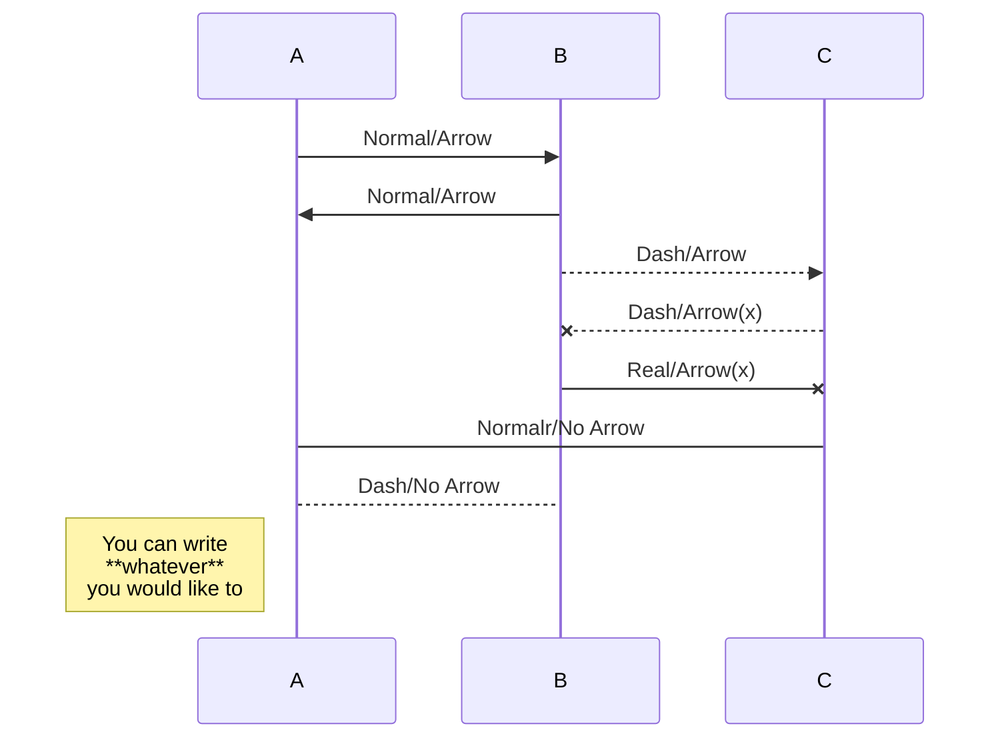
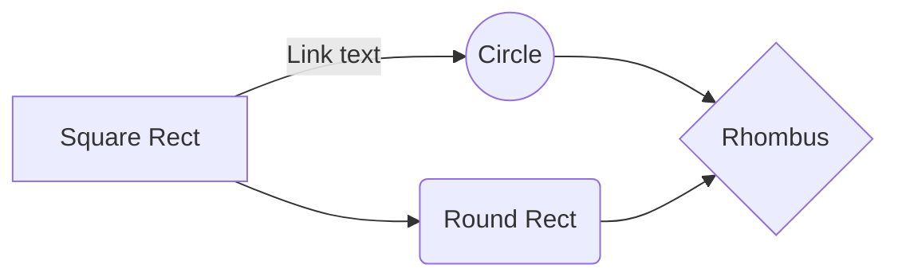

# Header 1 (including line)
## Header 2 (including line)
### Header 3 (not including line)
#### Header 4 (not including line)
##### Header 5 (not including line)
###### Header 6 (not including line)

## List

- Dot list 
-- Dash list 
-- Dash list 2
	> Description 1
	

 ## Table
|                |ASCII                          |HTML                         |
|----------------|-------------------------------|-----------------------------|
|Single backticks|`'Isn't this fun?'`            |'Isn't this fun?'            |
|Quotes          |`"Isn't this fun?"`            |"Isn't this fun?"  		   |
|Dashes          |`-- is en-dash, --- is em-dash`|-- is en-dash, --- is em-dash|

## Link

[google](https://google.com)
[naver](https://naver.com)

## Font
**Bold letter**
*Italic letter*

## Graph

- Diagram

- Chart

